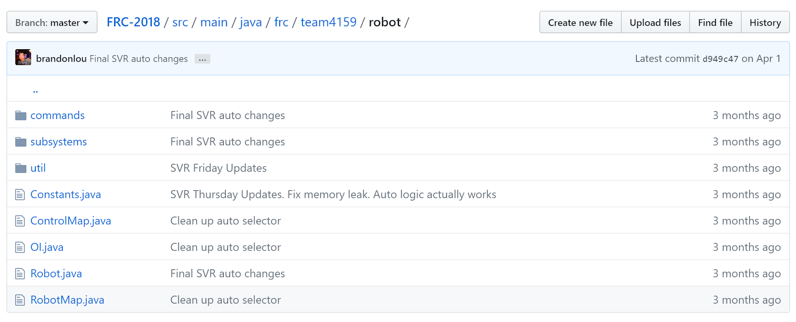
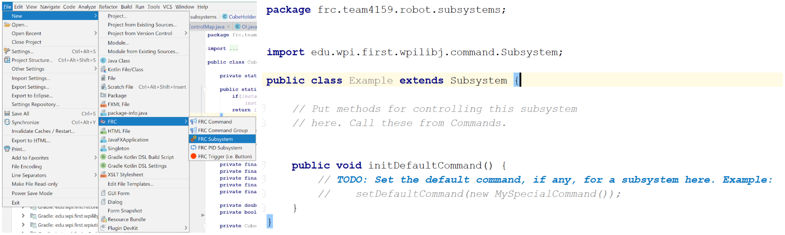

## Overview 

We follow the Command-based robot model to organize our robot code. This method of organization separates the robot code into subsystems and commands, and it allows us to utilize built-in support from WPILib.

 ||
 |:---:|
 |*Organization of our 2018 robot code*|
 
 Under this method, the robot code is divided into what the robot has and does ([subsystems](#subsystems)) and instruction for the robot ([commands](#commands)). We write functions for receiving joystick input and put these in the [Operator Interface (OI)](#operator-interface-(oi)) class. Fixed numbers ([constants](#constants)) are separated into their own files, making them quick to find and easy to change. Meanwhile, the [main robot class](#main-robot-class) stays nice and clean, handling initializations or periodic functions that don’t fit in elsewhere.
 
 In particular, the rest of this article explains how and why we organize our code this way, which may be different from other teams. To get a better idea of how Command-based Programming works, take a look at WPILib’s explanation: [What is Command based programming?](http://wpilib.screenstepslive.com/s/currentCS/m/java/l/599732-what-is-command-based-programming)

## Subsystems

### What's a Subsystem?

||
|:---:|
|*Our different subsystems (2018)*|
 
 The robot is split into separate subsystems, and although this is usually defined by the people who design the robot, our general rule is that one unit should be a group of sensors and output devices (eg. actuators or LEDs) that depend each other to perform actions, but each sensor and output can only belong to one subsystem. 
 
 For example, notice that our 2018 robot has a `CubeHolder` subsystem. This subsystem both picks up and shoots cubes, however, it cannot do both at once, since the motors that intake the cube are the same motors that shoot the cube. Thus, we awkwardly call it the `CubeHolder`, as opposed to making both a `CubeShooter` and `CubeIntake` class.
 By the way, you will break the code if you try to assign a single channel/ID to two motor controller objects. 
 
### What Goes in a Subsystem Class?

||
 |:---:|
 |*Start with the FRC plugin provided template*|
 
 As mentioned in the overview, a subsystem class is comprised of what the subsystem has and what it does (not necessarily when it does something, though; we’ll go over that later). What this means is variables for any sensors or output devices that belongs to a subsystem should be assigned here, as well as other variables or constants that only belong to that one subsystem. Additionally, you’ll want to put initializations and calls to configuration/setup functions in the class constructor. 
 
 ||
 |:---:| 
 |*Examples of variables and other setup in subsystems (2018)*|
 
 Right below the constructor, we can start writing out subsystem functions: the programming for everything the subsystems will do. This is where functions that set actuator speeds, positions, or modes go, and it is essentially where you do most of the actual programming.
 
 Make sure to check out the documentation for the [WPILib API](http://first.wpi.edu/FRC/roborio/release/docs/java/) and the [CTRE API](http://www.ctr-electronics.com/downloads/api/java/html/index.html) for what functions to use for what motor controllers, sensors, etc. For more detail on how to program these, see the [electronics section](https://team4159.github.io/main_electronics_intro.html) of our site.
 
 ||
 |:---:| 
 |*Examples of functions in subsystems (2018)*|
 
 Something to be careful of is that **this is not where code for joystick input goes.** The functions should not be programmed to depend on input from sources outside the class, but it's OK if the input (eg. sensor input) is coming from within the class.
 
 When programming an lifter, for instance, it's alright to write a function that uses the reading of an encoder initialized in the lifter's subsystem. On the other hand, you do not want include a function with something like, “if the joystick button is pressed, then stop.” Instead, get rid of that “if” and just write out the stopping part.
 
 So how do you get subsystem to actually do something? You've written out all the things that the subsystem can do, but the functions won't run unless you tell them to—and that's where commands come in. 
 
## Commands

### Teleoperated Period

### Autonomous Period

## Operator Interface (OI)

## Constants

### Control Map

### Robot Map

## Main Robot Class
