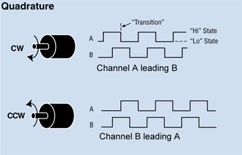
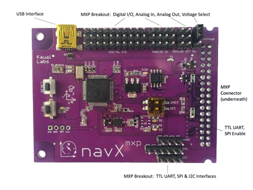

## Preface

Without sensors and feedback that utilizes them, your robot is basically an overengineered RC car.

_Seriously, in a demo event I remember one parent asked, "What makes this a robot and not just a RC car?" It was difficult to answer that question._

Let's take a look at the sensors we use in our FRC robots.

## Sensors

### 1. Encoders and Potentiometers

Encoders and potentiometers are both examples of rotary sensors - they measure rotation. They are the most commonly used sensors in our FRC robots. We can use encoders to measure the position of a rotating arm, flywheel speed, how much an elevator has been raised, and more.

Read [this article](http://frc-pdr.readthedocs.io/en/latest/motors/encoders.html) to learn the difference between absolute and relative (incremental) encoders.

||
|:---:|
|*Visual graph*|

You might see the term _quadrature encoder_ tossed around a lot. All that means is that the encoder can tell you the speed and rotation of a shaft bidirectionally (both forwards and backwards). This is possible because they send output through two channels, A and B, which are out of phase by 90 degrees. The phase difference is what determines the directionality, and that's why the function to flip the direction of an encoder reading is called `setSensorPhase`. Also, if you use a breakout board with an encoder, you'll need to be careful about getting the second signal wire in the right pin.

Pulses per revolution (PPR) is a measure of the resolution or precision of an incremental encoder, with one revolution being 360 degrees. Inevitably, encoders will slowly accumulate error. For example, an arm observed at 0 degrees might read 0 pulses, but after moving it away, then back to 0 degrees again, the encoder will read 340 pulses. To account for error, another sensor, such as a limit switch, can be used at some point of the arm's movement to reset the encoder. Better yet, if possible, use an absolute encoder.

For continuously turning systems, you can pair an encoder with a 360° potentiometer measuring the same output shaft then program the encoder to always be "zeroed" at start up. Team 971 has done this with their robots; a video of their process can be found [here](https://www.youtube.com/watch?v=Xs4IweRIG5g).

||
|:---:|
|*SRX Mag Encoder*|

We recommend the use of the [SRX Mag Encoders](http://www.ctr-electronics.com/srx-magnetic-encoder.html). They can be directly wired to Talon SRX's, and are easily programmable using [CTRE's libraries](http://www.ctr-electronics.com/downloads/api/java/html/index.html).

Read about potentiometers in this article [here](http://www.resistorguide.com/potentiometer/). Although we don't use potentiometers very often for our robots, they may prove more practical than encoders in certain circumstances. Here's a [Chief Delphi thread](https://www.chiefdelphi.com/forums/showthread.php?t=100332) on potentiometers vs. encoders, and why you'd want to use one over another.

||
|:---:|
|*Potentiometer. They're also known as "pots"*|

### 3. IMUs

Learn about the differences between accelerometers, gyroscopes, and IMU's in this [Sparkfun guide](https://www.sparkfun.com/pages/accel_gyro_guide).

These sensors can be used to keep the robot's drivetrain orientation, prevent it from tipping over, and more.

||
|:---:|
|*navX*|

We most commonly use the [navX-MXP by Kauai Labs](https://www.kauailabs.com/store/index.php?route=product/product&product_id=56). It plugs into the  RoboRio's MXP port, or alternatively, you can use their omnimount. The libraries provided by Kauai Labs make programming for the navX simple.

Other IMUs by FRC teams include the [Pigeon IMU](http://www.ctr-electronics.com/gadgeteer-imu-module-pigeon.html) (which is easily integrated with the Talon SRX), [ADIS16448](http://www.analog.com/en/products/sensors-mems/inertial-measurement-units/adis16448.html#product-overview) by Analog Devices, and [Spartan Board](https://numato.com/product/mimas-spartan-6-fpga-development-board) by 971.

### 4. Limit Switches

||
|:---:|
|*Limit switch*|

Read [this article](http://frc-pdr.readthedocs.io/en/latest/motors/limitswitch.html) to learn what limit switches are, how to wire them, and how to program them. WPILib also has an [article](http://wpilib.screenstepslive.com/s/currentCS/m/java/l/599744-using-limit-switches-to-control-behavior) on programming limit switches. When using a limit switch, be sure to note whether it's normally open (NO) or normally closed (NC).

Hall effect sensors can be used as a contactless limit switch. We recommend [this sensor](https://www.andymark.com/Electrical-p/am-3313.htm) intended for use on the DART actuator. If you'd like, you can learn about how hall effect sensors work [here](https://www.electronics-tutorials.ws/electromagnetism/hall-effect.html).

||
|:---:|
|*Hall effect*|

### 5. Other Not so Common (But Maybe Useful) Sensors

- Ultrasonic
- [Reed switches](http://www.clippard.com/cms/wiki/magnetic-reed-switches-position-location) (usually on pneumatic cylinders)
- [IR sensors](https://learn.adafruit.com/ir-sensor/overview)
- [Break beam sensor](https://learn.adafruit.com/ir-breakbeam-sensors?view=all)
- [LIDAR](https://www.sparkfun.com/news/2435) (probably overkill)
- Cameras in the [Vision section](/main-vision.html)

## Programming Sensors

Take a look at WPILib's official [sensor section](https://wpilib.screenstepslive.com/s/currentCS/m/java/c/88895). They provide information and code examples on how to implement different sensors into your FRC robot.

Other documentation:
- [Talon SRX User Guide](http://www.ctr-electronics.com/downloads/api/java/html/index.html)
- [Phoenix Framework Documentation](http://www.ctr-electronics.com/downloads/pdf/Talon%20SRX%20Software%20Reference%20Manual-1.pdf)
- [WPILib API Documentation](http://first.wpi.edu/FRC/roborio/release/docs/java/)

## Further Learning

FRC Team 1678 has done multiple workshops on "RoboRio and Sensors." Watch one of these videos to supplement our notes above.
- [Fall 2017](https://www.youtube.com/watch?v=tKSH2k5lTLs)
- [Fall 2016](https://www.youtube.com/watch?v=vhjChjfEvhM)